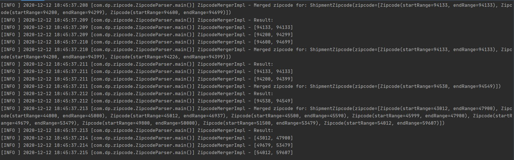
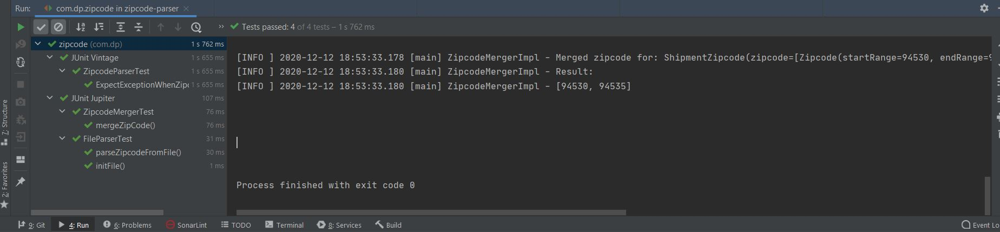

# zipcode_v2
Service to merge shipment zipcodes

## BACKGROUND 
Sometimes items cannot be shipped to certain zip codes, and the rules for these restrictions are stored as a series of ranges of 5 digit codes. For example if the ranges are:

[94133,94133] [94200,94299] [94600,94699]

Then the item can be shipped to zip code 94199, 94300, and 65532, but cannot be shipped to 94133, 94650, 94230, 94600, or 94299.

Any item might be restricted based on multiple sets of these ranges obtained from multiple sources.

## PROBLEM 
Given a collection of 5-digit ZIP code ranges (each range includes both their upper and lower bounds), provide an algorithm that produces the minimum number of ranges required to represent the same restrictions as the input.

## NOTES

* The ranges above are just examples, your implementation should work for any set of arbitrary ranges
* Ranges may be provided in arbitrary order
* Ranges may or may not overlap
* Your solution will be evaluated on the correctness and the approach taken, and adherence to coding standards and best practices
EXAMPLES: If the input = [94133,94133] [94200,94299] [94600,94699] Then the output should be = [94133,94133] [94200,94299] [94600,94699]

If the input = [94133,94133] [94200,94299] [94226,94399] Then the output should be = [94133,94133] [94200,94399]

## Evaluation Guidelines: 
Your work will be evaluated against the following criteria:

* Successful implementation
* Efficiency of the implementation
* Design choices and overall code organization
* Code quality and best practices

# Assumptions:
Assuming the zipcode json is coming as a file with just zipcode ranges of below json format:

```
[
[[94530,94538],[94531,94550]],
[[94531,94533],[94539,94559]]
]
```

## Datastructures used:
I have used LinkedList to store and merge the shipment zipcodes. LinkedList is used because it's very easy to insert zipcode in middle.

## Project type:
I have used maven to build the service

## File structure:
* config
    * ZipcodeDeserializer - To deserialize shipment zipcode json array
* entity
    * ShipmentZipcode - Pojo to hold zipcode object
    * Zipcode - Pojo to hold startRange and endRange of Zipcode
* service
    * FileParser - Interface that provides deserializing feature
    * ZipcodeMerger - Interface to merge the zipcode range
* util
    * ZipcodeComparator - Comparator to sort the zipcode by StartRange
* ZipcodeParser - Main Java file to start the shipment merge service

* resources - Place to keep the input shipment zipcodes and configuration properties

## Test:
* Used Junit with PowerMock runner to unit test the features
* Wrote unit test for each Java file segregated feature

## Sample output:
 
 
## Test case execution: 
 
